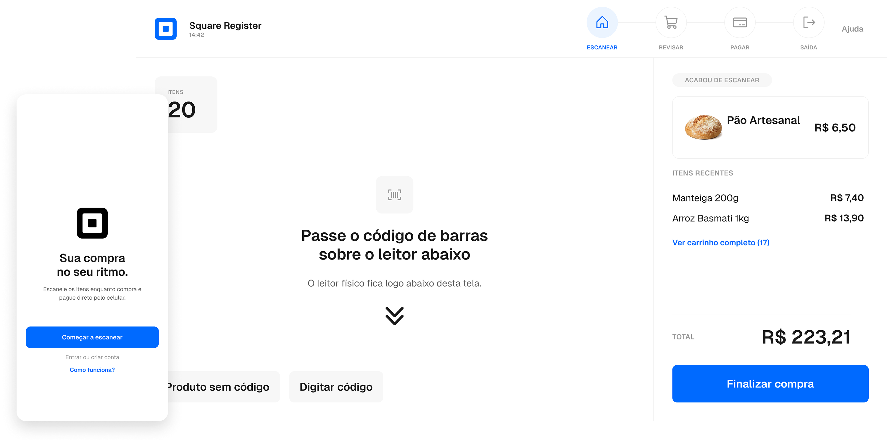

# Matheus Paiva — Product Designer

Portfólio pessoal e case study em produção: **[mvpaiva.com](https://mvpaiva.com)**

Product Designer em transição de carreira (arquitetura → e-commerce → produto),
focado em UX Research, interação e produtos com IA.

## Case em destaque: Square Self-Checkout

**[mvpaiva.com/square](https://mvpaiva.com/square)**

Redesign de 6 meses do autoatendimento do Square Register e de um app
complementar — do estacionamento até o portão de saída. Pesquisa de campo,
prototipação e 5 rodadas de teste com usuários reais.



## Contato

- [LinkedIn](https://www.linkedin.com/in/mvpaiva/)
- [X](https://x.com/heymvpaiva)
- [CV](https://drive.google.com/file/d/1uvIujKmLz8Pi8DUtY6Csqd97fqrKSyDz/view?usp=sharing)
- [mv@mvpaiva.com](mailto:mv@mvpaiva.com)

---

## Sobre este repositório

Código-fonte do portfólio: Next.js (App Router) + CSS puro (sem framework de
utilitários), fontes via `next/font/google` (Fraunces + Instrument Sans).
Deploy na Vercel via integração com o GitHub.

```
src/
  app/                rotas (App Router)
    page.tsx           "/" — home
    square/page.tsx     "/square" — case study Square Self-Checkout
    layout.tsx          fontes, metadata
    globals.css          tokens de design e reset
  components/          componentes de UI compartilhados
docs/                  specs de planejamento (ver docs/handoff.md primeiro)
```

Antes de mexer no design ou no conteúdo, leia [docs/handoff.md](docs/handoff.md)
— é o ponto de entrada que explica o resto dos documentos de spec e o estado
atual das decisões.

### Rodando localmente

```bash
npm install
npm run dev
```

Abra [http://localhost:3000](http://localhost:3000).
